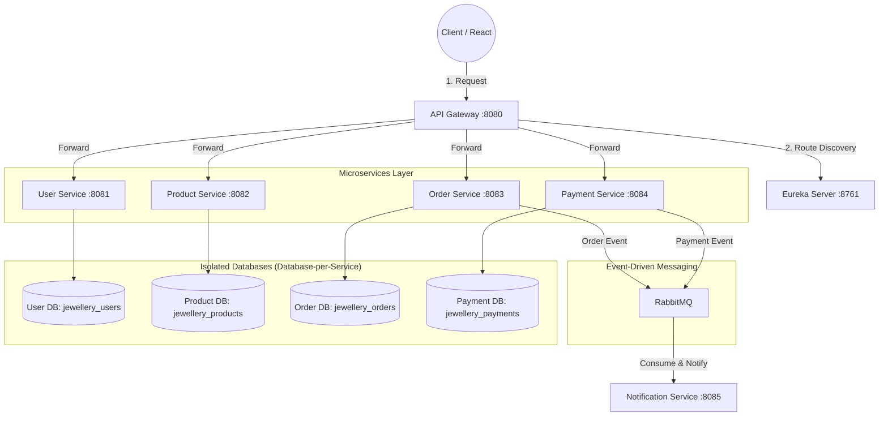

 # 💎 HirkaniSaaj (हिरकणी साज) - Deep Dive Technical Documentation

Welcome to the comprehensive technical guide for the **HirkaniSaaj (हिरकणी साज)** Haute Joaillerie platform. This document explains the architecture, security, distributed messaging, and technical decisions at an interview-ready level.

---

## 🏗 1. System Architecture: The "Why" and "How"

The project follows a **Microservices Architecture**. Instead of one large monolithic application, the platform is divided into autonomous, loosely coupled services communicating over HTTP REST (via API Gateway) and asynchronous message queues (RabbitMQ).

---

## 🛡 2. Security: Stateless JWT Authentication

Authentication in distributed microservices is stateless using **JSON Web Tokens (JWT)**:
1. **Login Request**: The user submits credentials to `User Service` via the Gateway.
2. **Token Minting**: `User Service` authenticates the credentials against the database using `BCryptPasswordEncoder` and signs a JWT with `HS256`.
3. **Client Storage**: The React client stores the JWT token in `localStorage`.
4. **Authorization Header**: For subsequent authenticated operations (profile, order placement), Axios Interceptors attach `Authorization: Bearer <TOKEN>`.
5. **Validation**: `JwtFilter` intercepts requests, extracts the claims, verifies the signature, and populates `SecurityContextHolder`.

---

## 📡 3. Service Discovery: Netflix Eureka

1. **Self-Registration**: On startup, each microservice registers its IP, port, and health status with `Eureka Server` (port 8761).
2. **Heartbeats**: Microservices send 30-second heartbeat renewals.
3. **Dynamic Routing**: `API Gateway` queries Eureka to resolve service names (e.g. `lb://product-service`) dynamically without hardcoded IP addresses.

---

## ✉️ 4. Asynchronous Event-Driven Messaging: RabbitMQ

When an order is created, notifications are decoupled from order persistence:
1. `Order Service` saves the order in `jewellery_orders` and publishes `OrderPlacedEvent` to the RabbitMQ exchange.
2. The user receives an immediate `201 Created` response.
3. `Notification Service` consumes the message from the queue and dispatches simulated email and SMS confirmations asynchronously.

---

## 💻 5. Frontend Design: HirkaniSaaj Royal Storefront

- **Brand Theme**: Royal Maratha Heritage (`#0B251C`, `#D4AF37`, `#FAF7F2`).
- **Typography**: `Cinzel`, `Playfair Display`, and `Plus Jakarta Sans`.
- **Key Pages**:
  - **Home**: Royal hero banner, Trust pillars, Collection categories, Trending masterpieces, Hirkani story.
  - **Products**: Collection filters, price filtering, sorting, wishlist toggle, hallmark purity indicators.
  - **Shopping Bag**: Promo discount codes (`HIRKANI10`), 3% Indian Gold GST, gift packaging.
  - **Checkout**: Delivery address validator, secure payment gateways (Cards, UPI, COD), order confirmed screen.
  - **Privé Portal**: Member tier card, order history timeline.

---

## 🚀 6. Interview Q&A Summary

**Q: Why use a Database-per-Service pattern?**  
A: To ensure strict loose coupling. No service can directly query or modify another service's tables, preventing cascading failures and allowing independent schema evolution.

**Q: How does Spring Cloud Gateway handle Cross-Origin Resource Sharing (CORS)?**  
A: Centralized CORS configuration in `api-gateway/src/main/resources/application.yml` intercepts preflight `OPTIONS` requests and applies consistent CORS headers across all microservices.
