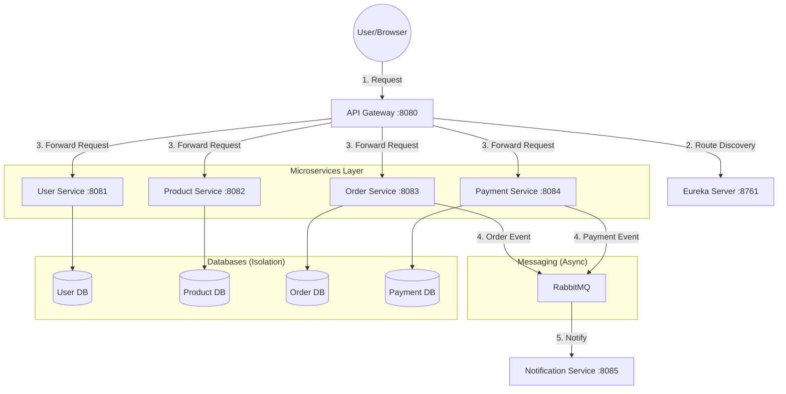
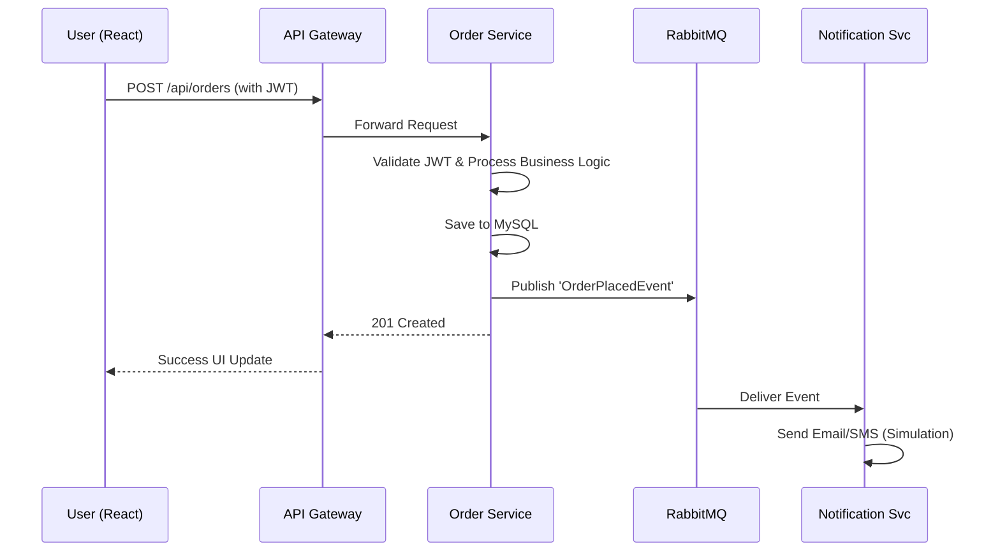

# 💎 Ratnalok Jewelry E-Commerce - Deep Dive Documentation

Welcome to the comprehensive technical guide for the Ratnalok project. This document is designed to help you understand the architecture, design patterns, and implementation details at a level that will prepare you for a technical interview as a fresher.

---

## 🏗 1. System Architecture: The "Why" and "How"

The project follows a **Microservices Architecture**. Instead of one large application (Monolith), the system is divided into small, independent services that communicate over the network.

### Why Microservices?
- **Scalability**: If the Product Service is slow, we can scale only that service without affecting others.
- **Independent Deployment**: You can update the Notification Service without stopping the Order Service.
- **Fault Tolerance**: If the Payment Service goes down, users can still browse products (Product Service is still up).
- **Tech Flexibility**: Different services could technically use different databases or languages (though we used Java for all).

### Architecture Components


---

## 🛡 2. Security Deep Dive: JSON Web Tokens (JWT)

In a microservices world, we can't use traditional "Sessions" because services are distributed. We use **JWT** for stateless authentication.

### The JWT Flow
1.  **Login**: User sends email/password to `User Service`.
2.  **Token Generation**: `User Service` validates credentials and creates a signed JWT using a `Secret Key`.
3.  **Client Storage**: The React frontend receives the token and stores it in `localStorage`.
4.  **Authorization Header**: For every subsequent request (e.g., placing an order), the Frontend adds the token: `Authorization: Bearer <TOKEN>`.
5.  **Validation**: The `JwtFilter` in the target service (or Gateway) intercepts the request, extracts the token, and validates the signature using the `Secret Key`.

### Under the Hood: `JwtUtil.java`
- **Claims**: Information stored inside the token (Username, Expiration, Roles).
- **Signing**: Uses `HS256` algorithm to ensure the token hasn't been tampered with.

---

## 📡 3. Service Discovery: Netflix Eureka

How does the API Gateway know where the Product Service is (IP and Port)?

1.  **Registration**: When `Product Service` starts, it tells Eureka: "I am 'product-service' and I am at 192.168.1.5:8082".
2.  **Heartbeats**: The service sends a signal every 30 seconds to Eureka to say "I'm still alive".
3.  **Discovery**: When a request comes to the Gateway for `/api/products/**`, the Gateway asks Eureka for the address of 'product-service' and then forwards the request.

---

## ✉️ 4. Asynchronous Messaging: RabbitMQ

When an order is placed, we want to notify the user. Doing this synchronously (calling the Notification Service directly) has downsides:
- If Notification Service is down, the order fails (Bad!).
- The user has to wait for the email/SMS to be sent before getting a confirmation (Slow!).

**Solution: RabbitMQ (Event-Driven)**
1.  **Order Service** (Producer) finishes the DB entry and "pushes" an `OrderPlacedEvent` to a RabbitMQ Queue.
2.  **Order Service** immediately returns success to the user.
3.  **Notification Service** (Consumer) listens to the queue. When it's free, it picks up the event and sends the notification.
4.  **Result**: Better performance and "loose coupling".

---

## 💻 5. Frontend: React & Modern UX

The frontend is built for speed and responsiveness.

### Key Technologies:
- **React Hooks**: `useState` for UI state, `useEffect` for API calls.
- **Axios Interceptors**: A central "security guard" (`api.js`) that:
    - Automatically attaches the JWT token to every outgoing request.
    - Redirects to `/login` if a `401 Unauthorized` error occurs (Token expired).
- **Framer Motion**: Used for "Micro-interactions" (buttons scaling, cards sliding in) to make the site feel premium.
- **Responsive Design**: CSS Grid and Flexbox ensure the jewelry catalog looks great on both Mobile and Desktop.

---

## 🔄 6. "A Day in the Life" of an Order (Workflow)

Tracing a request from start to finish:



1.  **Frontend**: User clicks "Place Order" in `Cart.js`.
2.  **Security**: `api.js` attaches the JWT token.
3.  **Gateway**: Receives request at `:8080/api/orders`. It checks its routing table and Eureka to find `order-service`.
4.  **Order Service**: 
    - `JwtFilter` validates the token.
    - `OrderController` receives data.
    - `OrderService` calculates total and saves to `OrderDB`.
    - `OrderService` publishes an event to **RabbitMQ**.
5.  **RabbitMQ**: Holds the message safely.
6.  **Notification Service**: Picks up the message and logs/sends a "Thank You" alert.
7.  **Frontend**: Receives a `201 Created` response and shows a success animation.

---

## 👨‍🏫 7. Interview Readiness: Q&A

**Q: What is an API Gateway?**
A: It's the entry point for the system. It handles routing, security, and CORS, so individual services don't have to worry about them.

**Q: What is the difference between Synchronous and Asynchronous communication?**
A: Synchronous (REST/Feign) is "wait for response". Asynchronous (RabbitMQ) is "fire and forget" using events.

**Q: Why use a database per service?**
A: It ensures "Loose Coupling". One service can't accidentally mess up another service's data. It also allows using different DB types (e.g., MySQL for Orders, MongoDB for Product Catalog).

**Q: How do you handle authentication in Microservices?**
A: We use JWT. It's stateless, meaning the backend doesn't need to store session data, making it easy to scale.

---

## 📂 File Structure Guide

### Backend (Java/Spring)
- `controller/`: The "Waiters" - they take your order (API request).
- `service/`: The "Chefs" - they do the hard work (Business logic).
- `repository/`: The "Storage" - they talk to the database.
- `entity/`: The "Blueprints" - they define what a Product or Order looks like.
- `dto/`: The "Packages" - used to transfer data safely between layers.

### Frontend (React)
- `src/services/api.js`: The central communication hub.
- `src/pages/`: Full screen views (Home, Products, Login).
- `src/components/`: Reusable pieces (Navbar, Footer, ProductCard).

---

## 🚀 8. Step-by-Step Setup Guide

Follow these steps exactly to get the system running on your local machine.

### Step 1: Prerequisites
- **Java 17+**: The language the backend is written in.
- **Maven**: The build tool that manages Java dependencies.
- **MySQL**: The relational database used for storing users, products, and orders.
- **RabbitMQ**: The message broker for asynchronous communication.
- **Node.js & npm**: For running the React frontend.

### Step 2: Database Setup
Execute these commands in your MySQL terminal:
```sql
CREATE DATABASE IF NOT EXISTS jewellery_users;
CREATE DATABASE IF NOT EXISTS jewellery_products;
CREATE DATABASE IF NOT EXISTS jewellery_orders;
CREATE DATABASE IF NOT EXISTS jewellery_payments;
```
*Tip: Ensure your MySQL 'root' user password is 'root' or update it in the `application.yml` of each service.*

### Step 3: Build the Project
Run this in the root folder to compile all microservices:
```powershell
mvn clean install -DskipTests
```
This generates `.jar` files in the `target/` folder of each service.

### Step 4: Starting the Backend (Critical Order)
1. **Eureka Server**: Start this first so other services can register.
2. **API Gateway**: Start this second to handle incoming traffic.
3. **Microservices**: Start User, Product, Order, and Payment services.
4. **Notification Service**: Start this last to begin listening for events.

*Command to run a service:*
`java -jar [service-name]/target/[file].jar`

### Step 5: Starting the Frontend
1. `cd jewelry-frontend`
2. `npm install` (First time only)
3. `npm start`
4. Visit `http://localhost:3000`

---

## 🛠 Troubleshooting for Freshers
- **Port already in use**: Another app is using the port (e.g., 8080). Close it or change the port in `application.yml`.
- **CORS Error**: Usually happens if the API Gateway is not running or the frontend is calling the microservice directly instead of going through the Gateway.
- **RabbitMQ Connection Refused**: Ensure the RabbitMQ service is started on your machine.
- **'react-scripts' not recognized**: This usually happens if `node_modules` are corrupted or missing. Avoid using `npm audit fix --force` as it can downgrade critical packages to incompatible versions. If this happens, restore `react-scripts` to `5.0.1` in `package.json` and run `npm install`.
